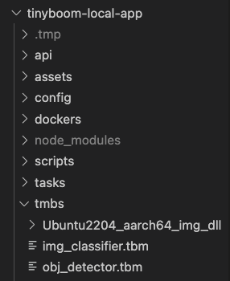

# Tinyboom Local App
Tinyboom Local App is a simple webapp that allows use of TBM files in inferencing image based data.

## Setup and Launch Guide

### Node.js
You will need Node.js to run this project. You can install Node.js by using `nvm` (Node Version Manager).

Download and install `nvm` by following the instruction in its website.
https://github.com/nvm-sh/nvm#installing-and-updating

Once you got `nvm` installed. Install Node.js and `npm` (Node Package Manager) by using this command.
```
$ nvm install 15
```
The above will install version 15 of Node.js. Verify that you can now use `node` and `npm`.
```
$ node -v
$ npm -v
```

### Configuration
To setup the webapp, you will need to update the following configuration attributes in `config/custom.js`:
- ldLibPath
  <br/>PATH of the library (DLL) files' directory
- tbmCwd
  <br/>the path to the current working directory
- tbmFile
  <br/>the path of the TBM file relative to `tbmCwd`
- tbmSocketFile
  <br/>the path of the socket file relative to `tbmCwd`

Example:
Scroll to the bottom part of the file to see the following attributes
```
...
  ldLibPath: "/workarea/tmbs/Ubuntu2204_aarch64_img_dll",
  tbmCwd: "/workarea/tmbs",
  tbmFile: "obj_detector.tbm",
  tbmSocketFile: "ex1.socket",
};
```

Please refer to our [documentation](https://aitoair.notion.site/AI-4476757101fb47f6b7693458e70282f8) for additional information about the configurations.

### Running the webapp in your local machine
The webapp uses npm to download the dependencies.
```
$ cd tinyboom-local-app
$ npm install
```

To run this webapp (still in `tinyboom-local-app` directory):
```
$ npm start
```

In your browser, go to this url to access the Tinyboom Local App: http://localhost:1337

### Running the webapp inside a docker container
Tinyboom Local App can be run inside a docker container but first you will need to build a docker image to run the webapp.

Use the following commands to build the docker image
```
cd dockers/
./build.sh
```

Place a copy of the DLL folder and TBM file inside the `tmbs` folder.



After the building of docker image is completed, you can run the docker container using this command:
```
./run-docker.sh
```
Inside the docker container, build and launch the application:
```
cd workarea/tinyboom-local-app/
npm install
npm start
```

In your browser, go to this url to access the Tinyboom Local App: http://localhost:1338
